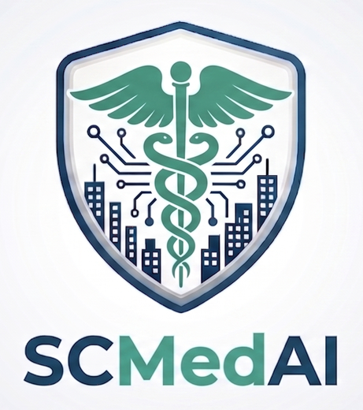

<p align="center">
  
</p>

<p align="center">
  <strong>Assistente de consulta a protocolos clínicos para profissionais de saúde.</strong><br>
  Responde em linguagem natural citando o documento, a versão e a página de origem.
</p>

<p align="center">
  <em>Não diagnostica, não prescreve e não decide.</em>
</p>

Veja o agente funcionando: [https://scmedai.streamlit.app/](https://scmedai.streamlit.app)

## Arquitetura

| Camada | Tecnologia | Responsabilidade |
| --- | --- | --- |
| Interface | Streamlit | Chat, histórico de sessão e exibição das citações |
| Orquestração | LangChain | Pipeline de ingestão, recuperação e geração |
| Geração | `gemini-2.5-flash` | Respostas ancoradas nos trechos recuperados |
| Embeddings | `gemini-embedding-001` | Vetorização dos documentos e das perguntas |
| Banco vetorial | ChromaDB | Armazenamento e busca por similaridade |
| Publicação | Nginx | Proxy reverso com suporte a WebSocket |
| Infraestrutura | OCI — VM Ubuntu + Load Balancer | Execução e ponto de entrada estável |
| Provisionamento | Terraform + cloud-init | Stack no OCI Resource Manager |


### Fluxo RAG

```text
PDFs → PyPDFLoader → chunks → gemini-embedding-001 → ChromaDB                                                   
```

**Consulta** — roda na instância, a cada pergunta:

```text
Pergunta
   │
   ├─→ gemini-embedding-001 ─→ ChromaDB ─→ k trechos mais similares
   │                                              │
   └──────────────────────────────────────────────┤
                                                  ▼
                                          gemini-2.5-flash
                                                  │
                                                  ▼
                                    Resposta + Fonte (documento · página)
```

## O que ele faz

- Localiza o protocolo pertinente a uma pergunta.
- Responde a pergunta citando a fonte do documento, versão, vigência e página.
- Abstém-se quando a informação não está no corpus.

## O que ele não faz

- Não sugere nem comunica diagnóstico ou prognóstico.
- Não emite conduta, prescrição ou plano terapêutico.
- Não avalia caso individual nem calcula dose para paciente específico.
- Não recebe nem armazena dado identificado de paciente.
- Não responde nada fora do corpus institucional indexado.

---

## Como rodar

Só é necessária uma chave gratuita do [Google AI Studio](https://aistudio.google.com/apikey)
— sem cartão de crédito. O `gemini-2.5-flash` está no tier gratuito.

```bash
git clone https://github.com/leonardo-lacerda-data/sc_med_ai.git
cd sc_med_ai

python -m venv .venv
# Windows:  .venv\Scripts\activate
# Linux:    source .venv/bin/activate

pip install -r requirements.txt
```

Copie o modelo de configuração e preencha a chave:

```bash
# Windows:  copy .example .env
# Linux:    cp .example .env
```

```env
GOOGLE_API_KEY=sua-chave-aqui
```

Suba a aplicação:

```bash
streamlit run app.py
```

Abre em `http://localhost:8501`.

```bash
python -m src.pdf_loader
```

O processo lê os PDFs, segmenta, gera os embeddings pela API do Gemini e
grava o índice. Leva cerca de um minuto para o corpus atual.

### Estrutura

```text
data/                     protocolos em PDF (corpus fictício)
chroma_db/                índice vetorial
prompts/                  prompt de sistema
~/respostas_esperadas.csv conjunto de referência para avaliação das respostas
src/                      carregamento, indexação e cadeia de recuperação
app.py                    interface Streamlit
OCI deploy/               stack Terraform para o OCI Resource Manager
```

## Deploy OCI

Provisionada por **Terraform** no OCI Resource Manager, inteiramente na
camada Always Free.

```text
                    Internet
                       │
              Load Balancer (10 Mbps · porta 80)
                       │            ponto de entrada estável
                       ▼
        VM.Standard.E2.1.Micro · 1/8 OCPU · 1 GB RAM
                       │
              ┌────────┴────────┐
              ▼                 ▼
         nginx :80        Streamlit :8501
      proxy reverso        serviço systemd
      (WebSocket)
```

## Stack

LangChain · Google Gemini · ChromaDB · Streamlit
Implantação em Oracle Cloud Infrastructure.
